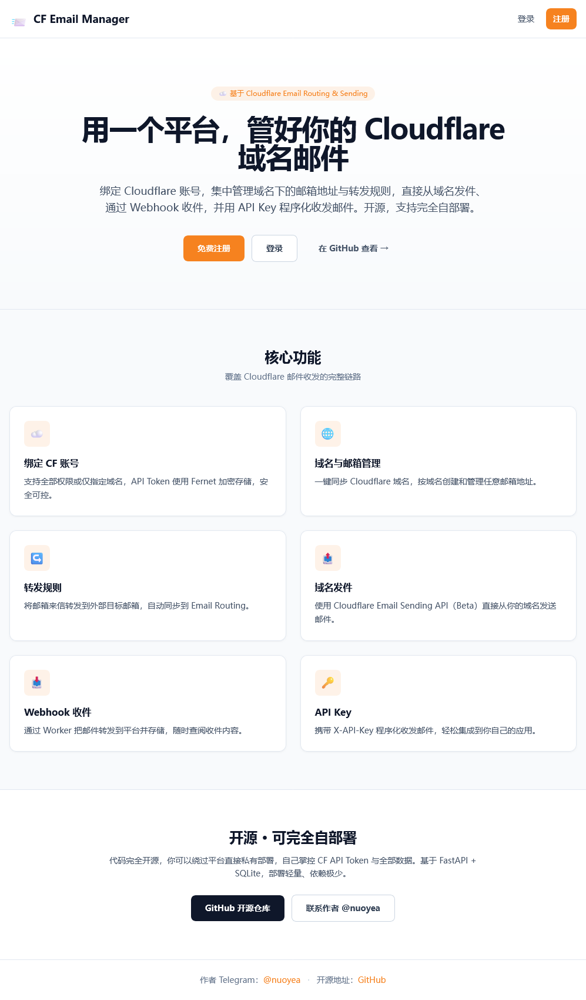

# CF Email Manager

**CF Email Manager** 是一个开源、自托管的 Cloudflare 域名邮箱管理平台。它可以帮你绑定 Cloudflare 账号，集中管理域名邮箱、转发规则、收件 Webhook、发件能力和 API Key。



## 适合谁

- 想自托管 Cloudflare Email Routing 管理后台
- 想给团队或多个用户分配域名邮箱能力
- 想把收到的邮件通过 Webhook 保存到自己的系统
- 想用 API Key 给内部工具提供轻量收发邮件能力
- 想基于 FastAPI 二次开发一个邮箱管理平台

## 核心功能

- 绑定 Cloudflare 账号并同步域名
- 创建邮箱地址、转发目标和转发规则
- 通过 Cloudflare Email Worker 接收邮件
- 通过 Cloudflare Email Sending API 发送域名邮件
- 管理 API Key，支持程序化发信和读取收件
- 管理员可分配平台域名给普通用户
- Web UI 和 JSON API 同时可用

> Cloudflare Email Sending 当前按 Beta 能力接入，默认每日限额为 **1000 封/天**。

## 技术栈

- FastAPI + uvicorn
- SQLite + SQLAlchemy Async ORM + Alembic
- Jinja2 + Tailwind + Alpine.js
- JWT、bcrypt、Fernet 加密
- pytest、pytest-asyncio、Playwright e2e
- Docker 与 Cloudflare Worker 示例

## 快速启动

```bash
python -m venv .venv

# Windows
.venv\Scripts\activate

# macOS / Linux
source .venv/bin/activate

pip install -r requirements.txt
cp .env.example .env
alembic upgrade head
uvicorn app.main:app --reload
```

启动后访问：

- Web UI: <http://localhost:8000/>
- Swagger API Docs: <http://localhost:8000/api/v1/docs>
- ReDoc: <http://localhost:8000/api/v1/redoc>
- Health Check: <http://localhost:8000/api/v1/health>

首次运行前建议先阅读 [配置与部署指南](docs/configuration.md)，至少修改 `.env` 里的 `SECRET_KEY`、`CF_WEBHOOK_SECRET`、`ADMIN_EMAIL` 和 `ADMIN_PASSWORD`。

## 文档入口

- [配置与部署指南](docs/configuration.md)：环境变量、本地配置、Docker、数据库迁移、Cloudflare Token、Worker 收件配置
- [Worker 示例说明](examples/worker/README.md)：手动部署 Cloudflare Email Worker

## 测试

运行单元与接口测试：

```bash
pytest tests/
```

测试使用独立 SQLite 内存数据库，Cloudflare API 调用全部 Mock，不会发真实网络请求。

运行 e2e 测试：

```bash
pip install pytest-playwright
playwright install chromium
pytest e2e/
```

e2e 通过 `CF_FAKE_MODE=1` 使用内置 Cloudflare 假数据，适合本地离线验证关键前端流程。

## 安全设计

- CF API Token 入库前使用 `SECRET_KEY` 经 Fernet 对称加密
- 用户密码使用 bcrypt 哈希
- API Key 只保存哈希，原始值只在创建时返回一次
- Webhook 使用 HMAC-SHA256 签名校验
- 登录、API Key 调用、公开邮件链接和 Webhook body size 内置单实例内存限制
- 生产环境强制 HTTPS `APP_BASE_URL`、安全 Cookie 和非默认密钥
- HTML 邮件正文在 Web UI 中隔离展示，降低内容注入风险

## License

MIT
